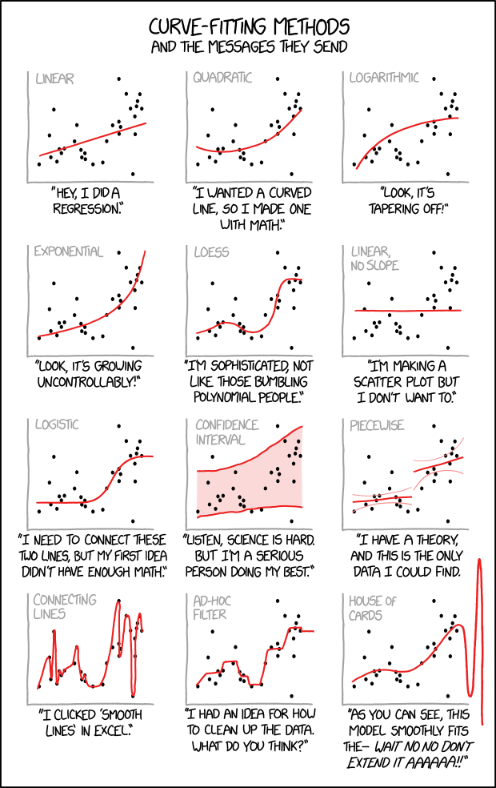

# 431 Fall 2018 Class 08: 2018-09-20

## Today's Materials

- The slides are available [in PDF](https://github.com/THOMASELOVE/431-2018/blob/master/slides/class08/431_class-08-slides_2018.pdf) and [in R Markdown](https://raw.githubusercontent.com/THOMASELOVE/431-2018/master/slides/class08/431_class-08-slides_2018.Rmd).
- Class 8 audio files will be posted when available: [Part 1](https://github.com/THOMASELOVE/431-2018/blob/master/slides/class08/431_class08audio_2018-09-20_part1.mp3), [Part 2](https://github.com/THOMASELOVE/431-2018/blob/master/slides/class08/431_class08audio_2018-09-20_part2.mp3) and [Part 3](https://github.com/THOMASELOVE/431-2018/blob/master/slides/class08/431_class08audio_2018-09-20_part3.mp3).

## Announcements

1. A reminder that [Homework 3](https://github.com/THOMASELOVE/431-2018/tree/master/homework/Homework3) is due on Friday at noon. Please get it in on time. Don't forget to review the [Hints for Homework 3](https://github.com/THOMASELOVE/431-2018/tree/master/homework/Homework3).

2. [Grades for Homework 2](http://bit.ly/431-2018-hw-grades) are now available at http://bit.ly/431-2018-hw-grades. 
    - This is a Google Sheet, so you'll need to log into Google via CWRU, then look for the **Homework 2** tab. 
    - You'll also need your 3-digit Homework Code for the semester, which Professor Love emailed to you on 2018-09-13.
    - You will also probably want to look at [the grading rubric](http://bit.ly/431-2018-hw2-rubric) at http://bit.ly/431-2018-hw2-rubric.
    - At the end of the term, we add up your scores on the 8 homework assignments, and divide by 800 to determine your homework grade. All Homeworks are treated as if they are worth 100 points, even though on some of them, like HW 2, it was possible to score higher than that. If your total at the end of the term is above 800 (and this has happened), you will receive a Homework grade of 100%.
    - In some comments, TAs wrote “Review Evans correlation guide.” This refers to this guide to interpreting correlation coefficients: from Evans, J. D. (1996). Straightforward statistics for the behavioral sciences. Pacific Grove, CA: Brooks/Cole Publishing. The correlation (r) is an effect size and so we can verbally describe the strength of the correlation based on the absolute value of r:
    
Absolute Value of Correlation Coefficient | 0 - 0.19 | 0.2 - 0.39 | 0.4 - 0.59 | 0.6 - 0.79 | 0.8 - 0.99
----------------------------------------: | -------- | ---------- | ---------- | ---------- | ----------
Description suggested by Evans | Very Weak | Weak | Moderate | Strong | Very Strong

3. I hope you've enjoyed what you've read so far in *The Signal and the Noise*. You'll need to have read through Chapter 3 to do [Homework 4](https://github.com/THOMASELOVE/431-2018/tree/master/homework/Homework4), which is due next Friday 2018-09-28 at noon.
4. Yesterday, [R Studio announced](https://blog.rstudio.com/2018/09/19/radix-for-r-markdown/) the release [Radix for R Markdown](https://rstudio.github.io/radix/), which is an online publication format designed for scientific and technical communication. It looks really exciting, and I look forward to trying it out.
5. [Minute Paper results from Class 7](http://bit.ly/431-2018-minute07-response) are in, at http://bit.ly/431-2018-minute07-response. Thank you to those of you who completed the task.
6. Next time, we'll be developing Project Groups. Review the [Course Project instructions](https://thomaselove.github.io/431-2018-project/) before class, please. If you're not going to be in class on Tuesday, please let Dr. Love know via email today.

## One Last Thing

Today, we will essentially complete our in-class discussion of the material contained in Chapters 1-10 of the [Course Notes](https://thomaselove.github.io/2018-431-book/). If you're wondering what's coming next, [XKCD has your answer](https://xkcd.com/2048/).

The main website for this course is https://github.com/THOMASELOVE/431-2018.
